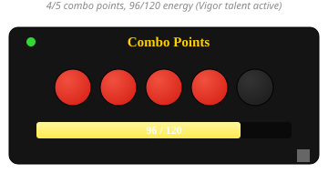

# OctoCombo

A simple, lightweight combo point and energy tracker for Rogues and Feral
Druids on the WoW 1.12 vanilla client, built and tested for **Turtle WoW**.

*(mockup illustration to scale with the addon's actual colors and layout —
not a live in-game capture)*

## Features

- 5 round combo point pips that light up as you build combo points, with a
  gold glow at 5/5 (finisher ready)
- Energy bar with current/max text that reflects your true max energy,
  including talent bonuses like Vigor
- Movable and resizable — drag to reposition, drag the bottom-right handle
  to resize
- Lockable (click-through) once you've got it positioned — the title bar
  hides itself while locked, leaving just the pips and energy bar
- Customizable pip color and energy number text color, with a preset
  palette or a full custom color picker
- Toggleable energy bar
- Position, size, and color settings are saved per character

## Installation

1. Download or clone this repo
2. Copy the folder into your WoW `Interface\AddOns\` directory, making sure
   the folder itself is named `OctoCombo`
3. Restart WoW or run `/reload`

## Slash commands

| Command | Effect |
|---|---|
| `/octocombo lock` | Lock the frame in place (click-through) |
| `/octocombo unlock` | Unlock the frame so you can drag it and reveal the resize handle |
| `/octocombo reset` | Reset position, size, and colors back to defaults |
| `/octocombo scale n` | Set the frame scale directly, e.g. `/octocombo scale 1.5` |
| `/octocombo energy` | Toggle the energy bar on/off |

## Options menu

While unlocked, click the small dot on the title bar above the pips to open
the options menu:

- Show/hide the energy bar
- Combo point pip color (preset palette or custom color picker)
- Energy number text color (preset palette or custom color picker)
- Lock frame

## Requirements

A WoW 1.12 client (Turtle WoW). Works for Rogues and Feral Druids.
